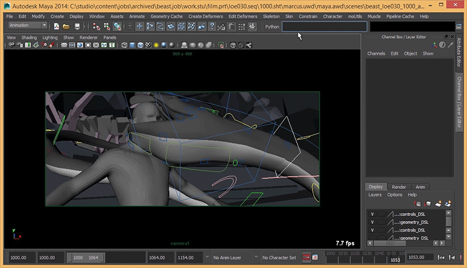

### Playblasting in Maya done right

Playblast with independent viewport, camera and display options.

- [Documentation][docs]
- [Issue tracker][issues]
- [Wiki][]

[issues]: https://github.com/mottosso/maya-capture/issues
[wiki]: https://github.com/mottosso/maya-capture/wiki
[docs]: http://maya-capture.readthedocs.org

### Usage

With a regular Maya playblast, playblasting is dependent on
the size of your panel and provides no options for specifying
what to include or exclude, such as meshes or curves. Maya
Capture isolates a capture into an independent window in which
settings may be applied without affecting your current scene or
workspace. It also playblasts the given camera, without regard
to which panel is currently in focus.

To install, download [capture.py][] and place it in a directory where Maya can find it.

[capture.py]: https://raw.githubusercontent.com/mottosso/maya-capture/master/capture.py

### Examples

```python
>>> from capture import capture
>>> capture()
>>> 
>>> # Capture multiple cameras
>>> capture('Camera1')
>>> capture('Camera2')
>>> capture('Camera3')
>>> 
>>> # Capture with custom resolution
>>> capture(width=400, height=200)
>>> 
>>> # Launch capture with custom viewport settings
>>> capture('persp', 800, 600,
...         viewport_options={
...             "displayAppearance": "wireframe",
...             "grid": False,
...             "polymeshes": True,
...         },
...         camera_options={
...             "displayResolution": True
...         }
... )
```
